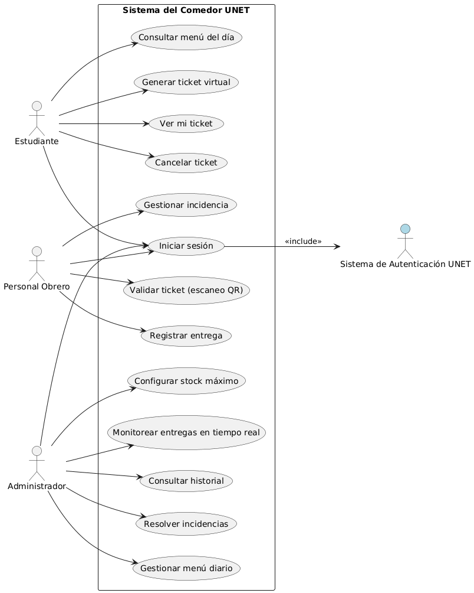

## Introducción

En el desarrollo de cualquier sistema de información, las fases iniciales del ciclo de vida son cruciales para comprender el problema, los usuarios involucrados y los requerimientos funcionales. El libro *Análisis y Diseño* (capítulos 5 y 6) propone diversas técnicas para llevar a cabo estas tareas de manera estructurada. En nuestro proyecto “Sistema del Comedor UNET”, hemos seleccionado dos técnicas fundamentales:

1. Identificación de actores  
2. Identificación de casos de uso

Estas técnicas nos permitirán modelar con precisión quiénes interactuarán con el sistema y qué acciones realizarán, sentando las bases para un diseño robusto y centrado en el usuario.

A continuación, explicamos cada técnica y detallamos cómo las aplicaremos en nuestro contexto.

---

## 1. Identificación de Actores

### ¿Qué es?
Un actor es cualquier entidad externa (persona, organización, sistema) que interactúa con el sistema en desarrollo. Los actores representan roles, no individuos concretos, y son esenciales para definir los límites del sistema y sus interacciones.

### Aplicación en el Sistema del Comedor UNET

Basándonos en el análisis de los *user personas* y *escenarios* previamente elaborados (ver PDF adjunto), hemos identificado tres actores principales:

| Actor | Descripción | Objetivo principal | Ejemplo de usuario real |
|-------|-------------|---------------------|-------------------------|
| Estudiante | Usuario final que solicita su almuerzo mediante el sistema. | Generar y presentar un ticket virtual (QR/PIN) para recibir su plato de manera rápida y ordenada. | Ana Pérez, estudiante de 5to semestre. |
| Personal Obrero | Personal de cocina encargado de la preparación, distribución y control de raciones. | Validar tickets en el comedor, registrar entregas y gestionar incidencias. | Ana López, jefa de cocina. |
| Administrador | Supervisor del servicio de comedor (puede ser un coordinador o directivo). | Configurar el menú diario, establecer límites de platos, monitorear entregas en tiempo real y gestionar reportes. | Juana Pérez, administradora del comedor. |

Adicionalmente, podrían identificarse actores secundarios como el Sistema de Autenticación UNET (para validar credenciales) o un Sistema de Pagos (si se integrara a futuro), pero en esta fase nos centramos en los actores humanos principales.

---

## 2. Identificación de Casos de Uso

### ¿Qué es?
Un caso de uso describe una secuencia de interacciones entre uno o más actores y el sistema, que produce un resultado observable de valor para el actor. Los casos de uso permiten capturar los requisitos funcionales desde la perspectiva del usuario.

### Aplicación en el Sistema del Comedor UNET

A partir de los escenarios definidos (ver PDF), hemos derivado los siguientes casos de uso para cada actor. Se presentan en formato de lista, con una breve descripción.

#### Actor: Estudiante

| Caso de uso | Descripción | Escenario de referencia |
|-------------|-------------|--------------------------|
| Iniciar sesión | El estudiante ingresa sus credenciales UNET para acceder al sistema. | (Implícito en todos los escenarios) |
| Consultar menú del día | Visualiza el menú disponible y la cantidad de platos restantes. | Escenario 2 (Consulta temprana) |
| Generar ticket virtual | Solicita un turno/plato; el sistema asigna un código QR y un horario sugerido. | Escenario 1 y 2 |
| Ver mi ticket | Consulta el ticket generado (QR, estado, horario). | Escenario 1 |
| Cancelar ticket (opcional) | Si no podrá asistir, libera su cupo para otro estudiante. | (Propuesto para futura versión) |

#### Actor: Personal Obrero
| Caso de uso | Descripción | Escenario de referencia |
|-------------|-------------|--------------------------|
| Iniciar sesión | Accede al panel de cocina con credenciales propias. | (Implícito) |
| Validar ticket (escaneo QR) | Escanea el código QR del estudiante y verifica su validez. | Escenario 2 (horario regular) |
| Registrar entrega | Marca el ticket como "Entregado" en el sistema. | Escenario 2 |
| Gestionar incidencia | Ante un ticket inválido o ya usado, registra la incidencia y sigue el protocolo (ej. derivar a administrador). | Escenario 1 (ticket inválido) |

#### Actor: Administrador

| Caso de uso | Descripción | Escenario de referencia |
|-------------|-------------|--------------------------|
| Iniciar sesión | Accede al dashboard administrativo. | (Implícito) |
| Gestionar menú diario | Crea o modifica el menú del día (platos, descripción, disponibilidad). | Escenario 2 (gestión diaria) |
| Configurar stock máximo | Establece el límite de platos para la jornada. | Escenario 2 |
| Monitorear entregas en tiempo real | Visualiza estadísticas de tickets generados vs. entregados, validaciones en curso. | Escenario 1 (supervisión) |
| Consultar historial | Revisa reportes de jornadas anteriores. | Escenario 1 |
| Resolver incidencias | Atiende casos reportados por el personal obrero (ej. tickets duplicados). | (Derivado de escenario de obrero) |

---

## Relación entre Actores y Casos de Uso

Para visualizar de forma integrada cómo se conectan los actores con los casos de uso, elaboraremos un diagrama de casos de uso en UML. Dicho diagrama mostrará:

- Al actor Estudiante conectado a los casos *Consultar menú*, *Generar ticket*, *Ver ticket*.
- Al actor Personal Obrero conectado a *Validar ticket*, *Registrar entrega*, *Gestionar incidencia*.
- Al actor Administrador conectado a *Gestionar menú*, *Configurar stock*, *Monitorear entregas*, etc.

---

## Conclusión

La aplicación de las técnicas de identificación de actores y casos de uso nos ha permitido:

- Definir claramente los límites del sistema y sus usuarios clave.
- Extraer los requisitos funcionales a partir de situaciones reales (escenarios).
- Establecer una base sólida para las siguientes fases del ciclo de vida (análisis, diseño e implementación).

Estas técnicas, provenientes del paradigma orientado a objetos y ampliamente respaldadas por el libro *Análisis y Diseño*, son fundamentales para garantizar que el Sistema del Comedor UNET responda efectivamente a las necesidades de estudiantes, personal y administradores, optimizando el servicio y reduciendo las problemáticas actuales (colas, desperdicio, falta de control).

---

## Referencias

- *Análisis y Diseño* (Capítulos 5 y 6). Material de apoyo de la asignatura.