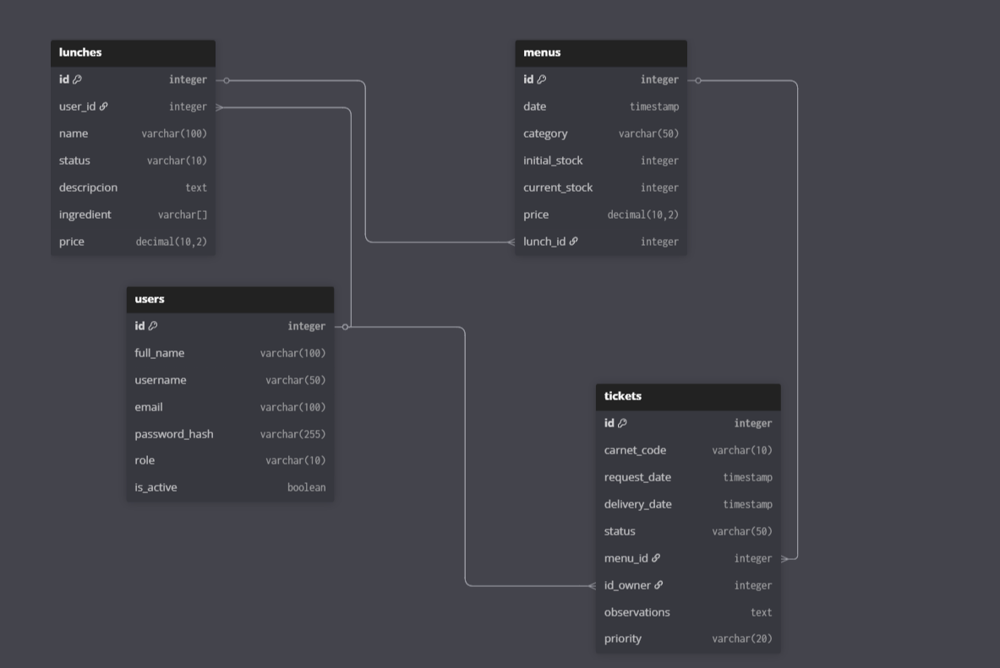
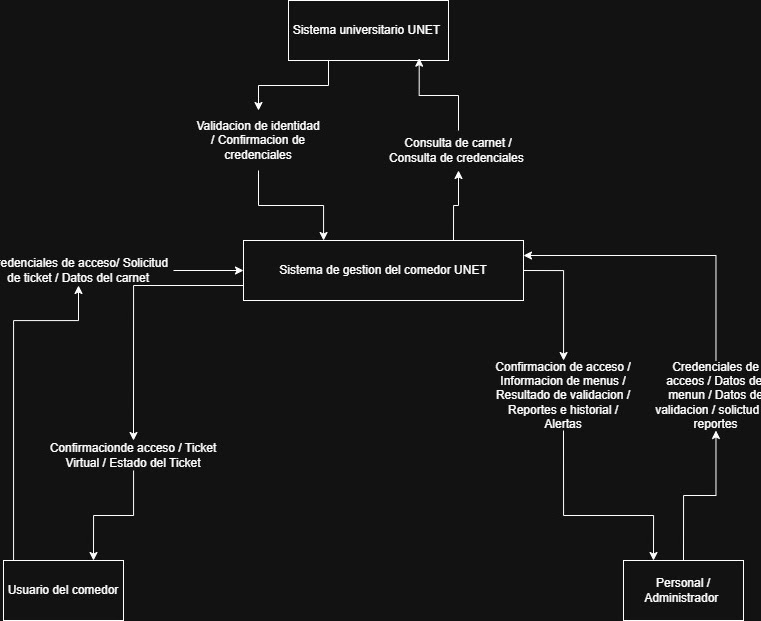
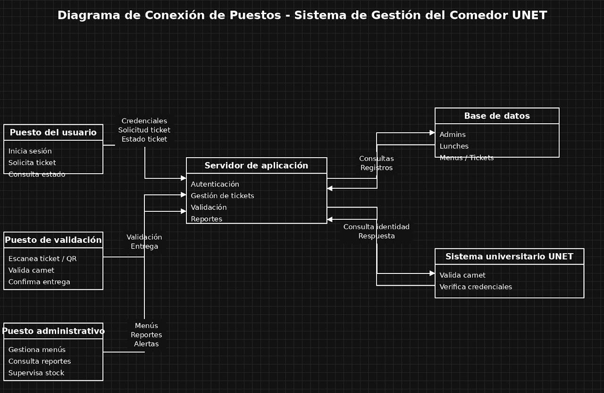

## Fase de Definición "Investigación de Hechos"
### 1. Introducción y alcance

Este documento resume los hallazgos de la fase de investigación de hechos en el comedor universitario de la UNET.

El objetivo fue:

- Comprender a profundidad los procesos actuales de control de ingreso.
- Analizar la comunicación de menús y la gestión de información.
- Identificar necesidades reales para el nuevo sistema.

### 2. Descripción de la situación actual (As-Is)

Se identificaron dos sistemas paralelos y desconectados.

#### 2.1 Sistema de control de repetición (sistema heredado)

- **Origen:** desarrollado de manera informal por un estudiante de semestres anteriores.
- **Funcionamiento detectado (según entrevista con operador y programador original):**
	- Probablemente es un programa de escritorio (quizás en Visual Basic o Python).
	- Utiliza una base de datos local (Access o archivo de texto).
	- Al llegar un estudiante, el personal ingresa cédula o nombre y el sistema marca que ya comió.
	- Es "único" porque no permite dos registros con la misma cédula en el mismo día.
- **Limitaciones observadas:**
	- No hay respaldo automático; si la PC falla, se pierde el control del día.
	- Es un sistema aislado; no se conecta con otros módulos.
	- El soporte depende de que el estudiante que lo creó siga disponible.

#### 2.2 Sistema de comunicación de menús

- **Canal actual:** comunidad de WhatsApp administrada por personal del comedor o representantes estudiantiles.
- **Funcionamiento detectado:** cada día alguien publica el menú (desayuno, almuerzo, cena) en el grupo.
- **Problemática observada (confirmada por estudiantes y observación directa):**
	- Alta saturación: los mensajes importantes se pierden entre cientos de mensajes.
	- Falta de estructura: la información no es uniforme (foto de pizarra, texto mal formateado, etc.).
	- Exclusión: no todos los estudiantes están en el grupo o lo silencian.
	- Ineficiencia: el personal no puede estimar cuántos estudiantes comerán para planificar compras y preparación.

#### 2.3 Proceso de ingreso físico

- **Observación directa (hora pico):**
	- El cuello de botella es la validación.
	- El personal alterna entre atender al estudiante, revisar lista/manual y operar el sistema heredado.
	- Esto genera colas largas y mayor riesgo de errores:
		- dejar pasar a alguien que ya comió,
		- marcar a la persona equivocada.

### 3. Necesidades y requerimientos detectados (To-Be)

Basado en entrevistas y observación, se identifican las siguientes prioridades:

#### 3.1 Centralización de la información

- **Necesidad:** un único sistema que integre gestión de menús y control de acceso/repetición.
- **Hecho que lo sustenta:** la desconexión entre WhatsApp (información) y programa local (control) genera duplicidad de esfuerzos y falta de trazabilidad.

#### 3.2 Acceso universal y multiplataforma

- **Necesidad:** aplicación web accesible desde celular, tablet y computadora.
- **Hecho que lo sustenta:**
	- Los estudiantes desean consultar el menú rápido desde el celular.
	- El personal administrativo necesita ver informes desde oficina o comedor.

#### 3.3 Visualización estructurada de menús

- **Necesidad:** mostrar menú del día (y potencialmente semanal) de forma clara, con platos, descripción y posibles advertencias nutricionales (ej: "contiene gluten").
- **Hecho que lo sustenta:** la información en WhatsApp es caótica y no cubre las necesidades del estudiante.

#### 3.4 Sistema de tickets con código único (QR)

- **Necesidad:** generar ticket digital/QR por estudiante y por servicio (desayuno, almuerzo, cena), válido una sola vez.
- **Hecho que lo sustenta:**
	- El sistema actual de "marcar" es lento y propenso a errores.
	- Un código escaneable acelera la validación y reduce fraude.
	- La unicidad debe ser infalible: si se presenta dos veces el mismo código, el sistema debe rechazarlo y alertar al personal.

#### 3.5 Gestión de usuarios y roles

- **Necesidad:** diferenciar perfiles:
	- estudiantes (ven menús y generan tickets),
	- administradores/personal (gestionan menús, escanean tickets y revisan reportes).
- **Necesidad adicional:** integración con registro universitario para validar estudiante activo.
- **Hecho que lo sustenta:**
	- El coordinador necesita saber quién entra y quién no.
	- El personal de cocina solo requiere escanear.

#### 3.6 Reportes y estadísticas

- **Necesidad:** reportes de consumo diario, horas de mayor afluencia y menús más populares.
- **Hecho que lo sustenta:** la planificación actual del coordinador es "a ojo", causando sobrantes o faltantes.

### 4. Restricciones y criterios de éxito

- **Tecnológicas:**
	- Solución web con framework moderno y escalable.
	- Base de datos robusta (PostgreSQL o MySQL) con respaldos automáticos.
- **De negocio:**
	- El escaneo no debe superar 3 segundos por estudiante.
	- La interfaz debe ser intuitiva para personal con baja experiencia técnica.
- **Legales:**
	- Cumplimiento de normativa de protección de datos.
	- No compartir información sensible de estudiantes.

## Fase de Modelización: el blueprint del sistema

### DER (diagrama entidad-relación)

### DFD (diagrama de flujo de datos)

### Modelado de redes (conectividad)

## Fase de Control: diccionario del proyecto

### Definición de datos

#### 1. Entidad: Usuarios (users)

Gestiona la identidad y los permisos de acceso al sistema.

| **Nombre Lógico**  | **Nombre Físico** | **Tipo de Datos** | **Dominio**                 | **Valor por Omisión** | **Integridad** |
| ------------------ | ----------------- | ----------------- | --------------------------- | --------------------- | -------------- |
| ID de Usuario      | id                | Integer           | \> 0                        | Autoincremento        | NOT NULL (PK)  |
| Nombre de Usuario  | username          | Varchar(50)       | Alfanumérico (Único)        | N/A                   | NOT NULL       |
| Correo Electrónico | email             | Varchar(100)      | Formato email institucional | N/A                   | NOT NULL       |
| Hash de Contraseña | password_hash     | Varchar(255)      | Cadena cifrada (Bcrypt)     | N/A                   | NOT NULL       |
| Rol de Usuario     | role              | Varchar(50)       | {Estudiante, Obrero, Admin} | 'Estudiante'          | NOT NULL       |
| Nombre Completo    | full_name         | Varchar(100)      | Alfabético                  | N/A                   | NOT NULL       |
| Estado de Cuenta   | is_active         | Boolean           | {true, false}               | true                  | NOT NULL       |

#### 2. Entidad: Platos/Almuerzos (lunches)

Define la base de datos de recetas y platos disponibles para los menús.

| **Nombre Lógico** | **Nombre Físico**      | **Tipo de Datos** | **Dominio**                     | **Valor por Omisión** | **Integridad** |
| ----------------- | ---------------------- | ----------------- | ------------------------------- | --------------------- | -------------- |
| ID de Plato       | id                     | Integer           | \> 0                            | Autoincrement         | NOT NULL (PK)  |
| ID Administrador  | admin_id               | Integer           | FK (Users.id)                   | N/A                   | NOT NULL       |
| Estado del Plato  | status                 | Varchar(50)       | {Disponible, Agotado, Inactivo} | 'Disponible'          | NOT NULL       |
| Nombre del Plato  | nombre_plato_principal | Varchar(100)      | Alfanumérico                    | N/A                   | NOT NULL       |
| Descripción       | descripcion            | Text              | Texto libre                     | N/A                   | NULL           |
| Ingredientes      | ingredientes           | Varchar\[\]       | Lista de ingredientes           | N/A                   | NULL           |
| Precio Base       | precio                 | Decimal(10,2)     | \> 0                            | 0.00                  | NOT NULL       |

#### 3. Entidad: Menús diarios (menus)

Controla la disponibilidad y el stock de comida por jornada específica.

| **Nombre Lógico** | **Nombre Físico** | **Tipo de Datos** | **Dominio**                 | **Valor por Omisión**  | **Integridad** |
| ----------------- | ----------------- | ----------------- | --------------------------- | ---------------------- | -------------- |
| ID de Menú        | id                | Integer           | \> 0                        | Autoincrement          | NOT NULL (PK)  |
| Fecha de Servicio | fecha             | Timestamp         | Fechas >= Hoy               | Current Date           | NOT NULL       |
| Categoría         | categoria         | Varchar(50)       | {Almuerzo, Cena}            | 'Almuerzo'             | NOT NULL       |
| Stock Inicial     | stock_inicial     | Integer           | 0 a 1000                    | 0                      | NOT NULL       |
| Stock Actual      | stock_actual      | Integer           | 0 <= valor <= stock_inicial | Valor de stock_inicial | NOT NULL       |
| Precio del Día    | precio            | Decimal (10,2)    | \> 0                        | N/A                    | NOT NULL       |
| ID del Almuerzo   | lunch_id          | Integer           | FK (Lunches.id)             | N/A                    | NOT NULL       |

#### 4. Entidad: Tickets de comedor (tickets)

Registra la transacción, garantiza la anti-suplantación y audita la entrega.

| **Nombre Lógico**  | **Nombre Físico** | **Tipo de Datos** | **Dominio**                       | **Valor por Omisión** | **Integridad**       |
| ------------------ | ----------------- | ----------------- | --------------------------------- | --------------------- | -------------------- |
| ID de Ticket       | id                | Integer           | \> 0                              | Autoincrement         | NOT NULL (PK)        |
| Código de Carnet   | codigo_carnet     | Varchar(50)       | Alfanumérico único                | N/A                   | NOT NULL             |
| Fecha de Solicitud | fecha_solicitud   | Timestamp         | Fecha y hora actual               | Current Timestamp     | NOT NULL             |
| Fecha de Entrega   | fecha_entrega     | Timestamp         | Fecha y hora de validación        | N/A                   | NULL (Hasta entrega) |
| Estado del Ticket  | estado            | Varchar(50)       | {Pendiente, Entregado, Cancelado} | 'Pendiente'           | NOT NULL             |
| ID de Menú         | menu_id           | Integer           | FK (Menus.id)                     | N/A                   | NOT NULL             |
| ID de Validador    | validado_por_id   | Integer           | FK (Users.id)                     | N/A                   | NULL (Hasta entrega) |
| Observaciones      | observaciones     | Text              | Comentarios de auditoría          | N/A                   | NULL                 |
| Prioridad          | prioridad         | Varchar(20)       | {Baja, Media, Alta}               | 'Baja'                | NOT NULL             |

### Definición de estructuras

#### 1. Estructura de usuario (E_Usuario)

Define la composición del perfil de usuario para procesos de autenticación y gestión.

`E_Usuario = id + username + email + password_hash + role + full_name + is_active`

- **Secuencia (+):** todos los campos son obligatorios para crear el perfil.
- **Selección ([...]):** role = [Estudiante | Obrero | Admin].

#### 2. Estructura de menú diario (E_Menu_Diario)

Representa la oferta disponible en una fecha específica para control de stock.

`E_Menu_Diario = id + fecha + categoria + stock_inicial + stock_actual + precio + lunch_id`

- **Selección ([...]):** categoria = [Almuerzo | Desayuno].
- **Repetición ({...}):** el sistema gestiona {E_Menu_Diario} para historial y planificación semanal.

#### 3. Estructura de ticket virtual (E_Ticket)

Es la estructura crítica para validación y prevención de suplantación de identidad.

`E_Ticket = id + codigo_carnet + fecha_solicitud + (fecha_entrega) + estado + menu_id + (validado_por_id) + (observaciones) + prioridad`

- **Opcionales ((...)):** fecha_entrega y validado_por_id solo se completan cuando estado = Entregado.
- **Selección ([...]):** estado = [Pendiente | Entregado | Cancelado].

#### 4. Estructura de plato/lunch (E_Plato)

Define los detalles técnicos y culinarios del alimento.

`E_Plato = id + admin_id + status + nombre_plato_principal + (descripcion) + {ingredientes} + precio`

- **Repetición ({...}):** {ingredientes} representa una lista de componentes del plato.

### Definición de procesos principales

Estos procesos representan las funciones lógicas necesarias para optimizar control y operación.

- **Autenticación:** validación de identidad mediante JWT y credenciales UNET para acceso por roles.
- **Solicitud de ticket:** generación de código QR único con firma HMAC y timestamp para reservar plato.
- **Validación de entrega:** escaneo de QR y cruce con carnet universitario físico para marcar estado Entregado.
- **Gestión de stock:** ajuste en tiempo real tras cada validación exitosa.
- **Generación de métricas:** procesamiento histórico para gráficas de demanda y desperdicio estimado.

### Flujos de información (DFD)

Los flujos describen el recorrido de datos desde su origen hasta su destino final.

- **Flujo de reserva:** Usuario envía credenciales -> sistema devuelve Token -> usuario selecciona Menú -> sistema genera Ticket QR y lo almacena en base de datos.
- **Flujo de verificación:** personal de comedor escanea QR -> sistema consulta estado del ticket -> sistema compara ID de usuario con carnet físico -> se actualiza estado en Tickets.
- **Flujo de administración:** administrador ingresa menú del día -> datos se guardan en Menus -> información se despliega en vista inicial del frontend.

## Estrategia de desarrollo: prototipado y ciclo de vida

El enfoque RAD permite entregar valor rápido, recibir retroalimentación continua y minimizar riesgos.

Se plantea en tres ciclos con objetivo y entregable concreto.

### Iteración 1: Prototipo de baja fidelidad (maquetas de pantalla) - "El Esqueleto"

- **Objetivo:** visualizar interfaz y flujo de navegación sin código funcional.
- **Duración estimada:** 1 semana.
- **Actividades concretas para el Comedor UNET:**
	- Identificar pantallas clave (según requerimientos y DFD):
		- Login (estudiantes y administradores).
		- Menú del día (vista estudiante).
		- Generación de ticket (botón para crear QR).
		- Escaneo (vista administrador/personal).
		- Gestión de menús (formulario para coordinador).
		- Reportes (dashboard con gráficos).
	- Dibujar maquetas en papel, pizarra o herramientas como Balsamiq, Figma (wireframe) o PowerPoint.
	- Ejemplo práctico:
		- título "Menú de Hoy",
		- secciones de desayuno, almuerzo y cena,
		- botón "Generar mi Ticket".
	- Validar con usuarios:
		- Reunir coordinador, estudiante y trabajador del comedor.
		- Pregunta guía: "Imagina que estás en el comedor y quieres tu ticket, ¿dónde harías clic?".
		- Registrar ajustes sugeridos en tiempo real.
- **Entregable:** álbum de wireframes (digital o físico) validado y corregido por usuarios.

### Iteración 2: Prototipo de alta fidelidad (prototipo funcional) - "El Simulador"

- **Objetivo:** construir versión interactiva simulada para probar UX y lógica de negocio.
- **Duración estimada:** 2-3 semanas.
- **Actividades concretas para el Comedor UNET:**
	- Elegir herramienta de prototipado rápido:
		- Figma (interacciones),
		- Adobe XD,
		- Glide/Bubble,
		- PowerPoint con hipervínculos,
		- o mini sitio estático con HTML/CSS/JS simulado.
	- Simular historias críticas:
		- **Historia 1 (Estudiante):** inicia sesión de prueba, ve menú, genera ticket y visualiza QR falso.
		- **Historia 2 (Personal):** simula escaneo, valida ticket y muestra alerta por intento duplicado.
	- Probar lógica de negocio:
		- validar fecha de vigencia del ticket,
		- confirmar visibilidad de alertas por duplicado,
		- verificar tiempo de escaneo simulado menor a 3 segundos.
	- Recolectar retroalimentación profunda mediante prueba piloto.
	- Registrar descubrimientos potenciales:
		- menú público sin login,
		- botón de reportar incidencia,
		- incluir foto del estudiante en el QR para verificación.
- **Entregable:** prototipo navegable + informe de retroalimentación y cambios solicitados.

### Iteración 3: Ingeniería de la información completa y sistema final - "La Realidad"

- **Objetivo:** construir sistema real con base de datos, backend, frontend, seguridad, respaldos y despliegue.
- **Duración estimada:** 4-8 semanas (según complejidad y equipo).
- **Actividades concretas para el Comedor UNET:**
	- Configurar entorno de desarrollo:
		- Backend: Python (Django/Flask), Node.js o PHP (Laravel).
		- Frontend: React, Vue o motor de plantillas.
		- Base de datos: PostgreSQL o MySQL.
		- Control de versiones: Git (GitHub/GitLab).
	- Desarrollar por módulos:
		- **Autenticación:** login/registro y roles (estudiante, admin-comedor, admin-super).
		- **Gestión de menús:** CRUD y programación semanal.
		- **Generación de tickets:**
			- validar que no exista ticket previo del mismo servicio en el día,
			- generar token único (UUID) y QR,
			- guardar id_ticket, id_usuario, fecha_generacion, servicio, usado, fecha_uso.
		- **Escaneo:**
			- activar cámara con getUserMedia,
			- extraer token y consultar BD,
			- aplicar lógica:
				- token válido y no usado -> acceso concedido,
				- token válido y usado -> alerta de repetición + auditoría,
				- token inexistente -> ticket inválido.
		- **Reportes:** gráficos diarios/semanales, horas pico y menús populares (ej. Chart.js).
	- Ejecutar pruebas integrales:
		- pruebas unitarias,
		- pruebas de integración,
		- pruebas de carga (ej. JMeter con 100 solicitudes concurrentes),
		- pruebas de aceptación con usuarios reales.
	- Despliegue y puesta en marcha:
		- elegir hosting (servidor UNET o nube como AWS/Heroku/DigitalOcean),
		- configurar dominio (ej. comedor.unet.edu.ve),
		- capacitar personal,
		- migrar datos del sistema anterior (por ejemplo, desde Excel).
- **Entregable:** sistema completo en producción, acompañado de:
	- manual de usuario,
	- código fuente documentado,
	- plan de respaldo y mantenimiento.