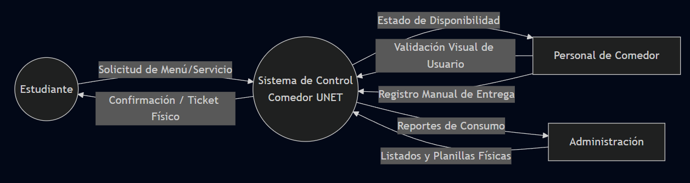
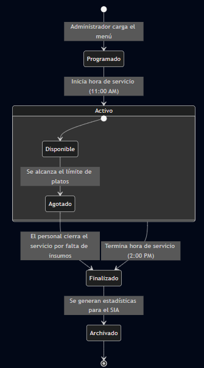
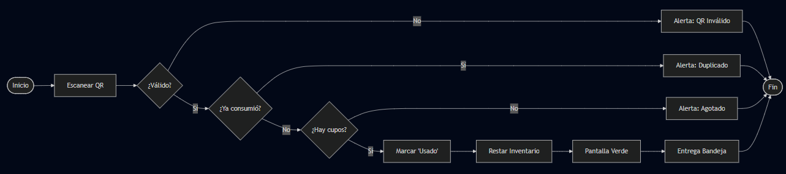
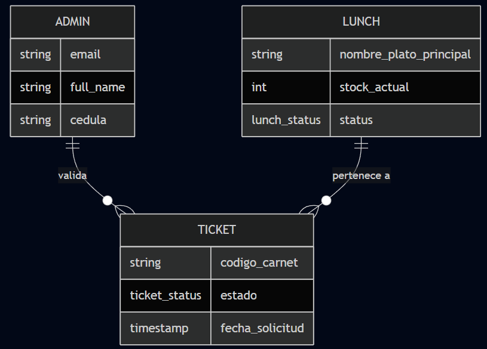
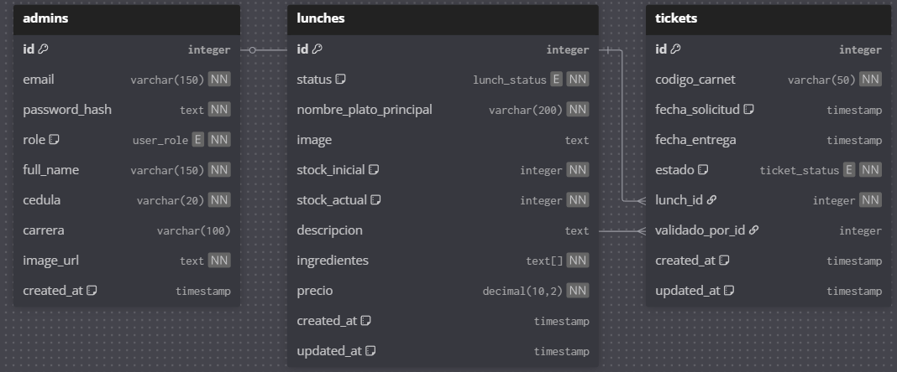
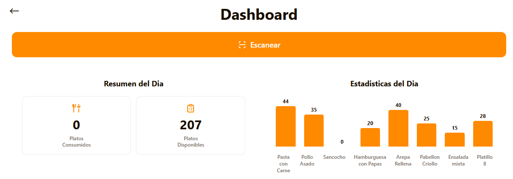
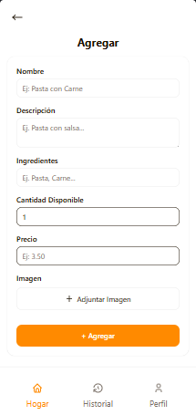
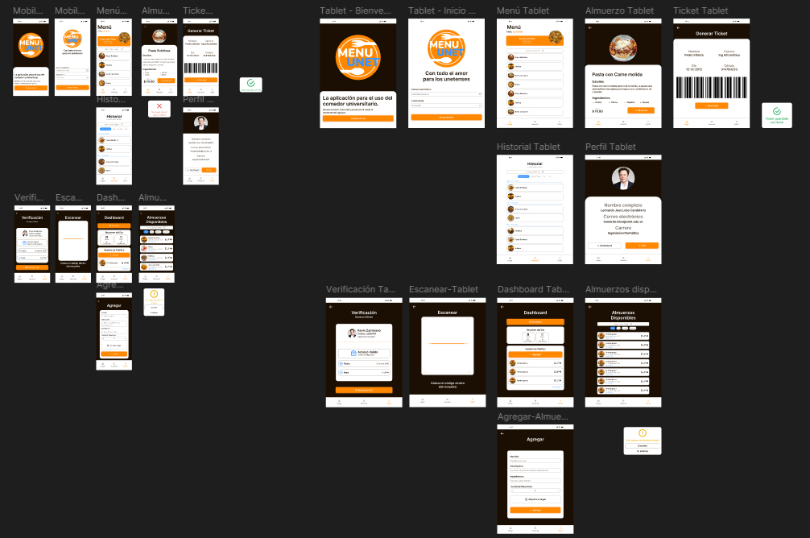

## 1. Análisis de Sistemas: El Cimiento del Proyecto

### 1.1. Fase de Inspección (Viabilidad)
Se realizó un estudio integral para asegurar la sostenibilidad del proyecto:
* **Viabilidad Técnica:** Uso de tecnologías modernas como Go y Astro, compatibles con la infraestructura UNET.
* **Viabilidad Económica:** Reducción de costos en consumibles (tickets de papel) y optimización de insumos alimenticios.
* **Viabilidad Operativa:** Interfaz simplificada para el personal obrero y procesos automatizados para los estudiantes.
* **Técnicas utilizadas:** Se aplicaron entrevistas preliminares y recolección de datos mediante encuestas.

### 1.2. Fase de Estudio (Sistema Actual)
El proceso actual funciona de forma manual y se apoya en listados físicos, validación visual y tickets impresos que generan cuellos de botella.

Hoy el flujo ocurre, en términos generales, así:

1. El estudiante consulta o solicita el menú por medios informales o en el punto de atención.
2. El personal revisa disponibilidad y confirma si el usuario puede recibir el servicio.
3. Se registra la entrega de forma manual en listas, planillas o controles físicos.
4. Si existe error, repetición o falta de cupo, la verificación se hace en el momento con intervención del personal.

Este análisis se representa mediante un **DFD de nivel 0** o **diagrama de contexto**, porque muestra el sistema como una sola unidad y sus interacciones con los actores externos.

### 1.3. Fase de Definición (Requerimientos)
Utilizando el **Método MoSCoW**, se priorizaron las necesidades:
* **Must have (Obligatorio):** Generación de QR único, validación en tiempo real y registro de bandejas servidas.
* **Should have (Deseable):** Reportes estadísticos diarios para la administración.
* **Could have (Opcional):** Historial de consumo por usuario, notificaciones del menú del día y mejoras visuales en el panel administrativo.
* **Won't have (Por ahora no):** Pagos en línea, integración con otros sistemas universitarios no relacionados y funcionalidades de compra fuera del comedor.

---

## 2. Diseño de Sistemas: La Arquitectura de la Solución
Se define la estrategia de construcción del software para transformar los requisitos en realidad.

* **2.1. Definición del Enfoque:** Se utiliza un diseño **Top-down** y **Orientado a Objetos** para garantizar la modularidad de los componentes.
* **2.2. Fase de Selección:** Se eligió una arquitectura de **Microservicios/Desacoplada** para permitir que el escáner de tickets funcione de forma independiente al panel administrativo.
* **2.3. Fase de Adquisición (Stack Tecnológico):**
    * **Backend:** Go (Golang) por su eficiencia en concurrencia.
    * **Frontend:** Astro + React para una carga ultra rápida en dispositivos móviles.
    * **Base de Datos:** PostgreSQL por su robustez relacional.
* **2.4. Diseño e Integración:** Los módulos se conectan mediante una API REST protegida por JWT.

---

## 3. Análisis de Datos y Sucesos

### 3.1. Análisis de Datos
El flujo de datos inicia en la solicitud del estudiante y culmina en la actualización del inventario de servicios del día.

### 3.2. Normalización
Se aplicó un proceso riguroso para eliminar redundancias:
1. **1FN:** Eliminación de atributos multivaluados en las tablas de Usuarios y Tickets.
2. **2FN:** Asegurar que los atributos no clave dependan totalmente de la llave primaria.
3. **3FN:** Eliminación de dependencias transitivas, separando la información en sus respectivas tablas sin repetir atributos.

### 3.3. Análisis de Sucesos
Este diagrama representa cómo cambia el estado del servicio diario (por ejemplo, el almuerzo del lunes) en la base de datos según la demanda y las acciones del administrador. Es uno de los procesos principales del sistema.

---

## 4. Análisis y Diseño de Procesos

* **4.1. Modelo de Implantación:** Se optó por una **implantación por fases**, comenzando con un grupo piloto de estudiantes antes del despliegue total.
* **4.2. Diseño General:** La lógica de negocio se describe mediante el siguiente flujo de actividades.

---

## 5. Diseño de la Base de Datos
Presentación del esquema estructural del sistema.

* **Modelo Entidad-Relación (MER):** Define las relaciones entre Estudiantes, Tickets, Menús y Personal.

* **Modelo Relacional:** Detalle de llaves primarias (PK) y foráneas (FK) alineadas con la normalización.

---

## 6. Diseño de Interfaces (UI/UX)
El sistema busca ser intuitivo y usable.

* **6.1. Principios:** Se aplicaron las **Leyes de Gestalt** y principios de **Diseño Atómico** para mantener la consistencia visual.
* **6.2. Prototipos de Entrada/Salida:** Reportes de consumo diario y formularios de registro de platos.

* **6.3. Mockups Finales:** Diseñados en Figma para asegurar una experiencia óptima.

